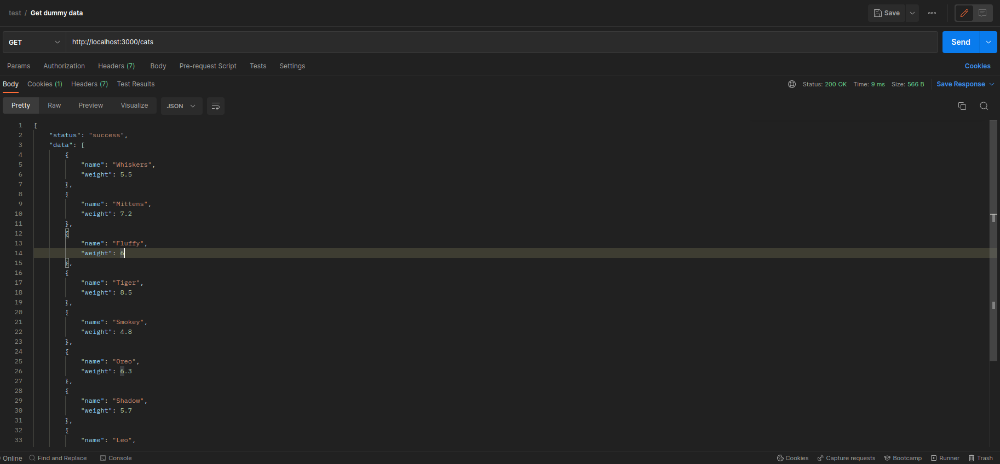

## Exercise 1

Build a simple API endpoint using Nest.js that returns a list of dummy data. Test the endpoint using a tool like Postman.

.

## Installation

```bash
$ npm install
```

## Running the app

```bash
# development
$ npm run start

# watch mode
$ npm run start:dev

# production mode
$ npm run start:prod
```
